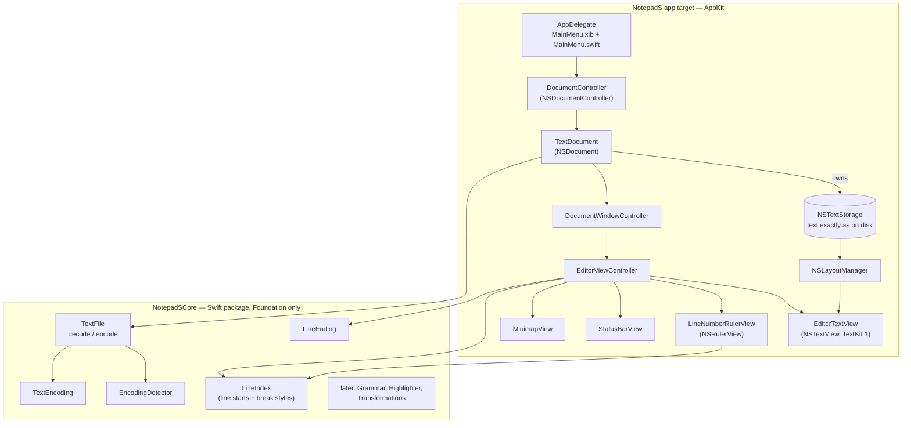

# NotepadS — Design

Contents: 1. Critique of the brief and decisions · 2. Architecture · 3. Project structure · 4. Work plan · 5. Phase 0 change list (first Claude Code task)

> **Status (read first).** The phase 1 code in this repository is a *draft written without a compiler*, and it predates four decisions made afterwards: line breaks are preserved as on disk (§1, risk 2), unencodable input triggers a dialog instead of being refused (risk 3), the menu bar comes from a XIB so no private API is needed (risk 14), and builds are signed locally because there is no paid developer account yet (§2.4). **Phase 0 (§4, §5) makes the code compile and brings it in line with these decisions.** Where this document and the code disagree, this document wins.

---

## 1. Critique of the brief and decisions

### Decisions at a glance

| Topic | Brief | Decision | Reason |
|---|---|---|---|
| App lifecycle | AppKit + `NSDocument` | **Follow** | Autosave, versions, recents, tabs, restoration, external-change and locked-file handling for free. `DocumentGroup` hides the window/text-view control this app needs. |
| Text engine | TextKit 1 | **Follow, built explicitly** | Mature `NSRulerView`/glyph drawing, `allowsNonContiguousLayout` for big files. Build the stack by hand (storage → layout manager → container → view); never `init(frame:)` or `scrollableTextView()`. |
| UI construction | — | **Views and logic in code; menu bar from Xcode's "Main Menu" XIB**, adjusted in code | Code is reviewable and AI-friendly. The menu bar is the exception: a XIB is the only public way to get a working Open Recent menu (risk 14). |
| Xcode project | — | **XcodeGen (`project.yml`)**, `.xcodeproj` not committed | `.pbxproj` edits are the most common source of broken AI diffs. XcodeGen is a dev tool, not an app dependency. |
| Never lose text | Autosave + restoration | **Follow + one override** (`NSQuitAlwaysKeepsWindows`) | Restoration alone fails under a default macOS setting (risk 1). |
| Line endings | Detect & preserve | **Store line breaks exactly as on disk**; new breaks use the document's style; unify only on explicit "Convert Line Endings" | Editing one line must not change other lines (no whole-file Git diffs). See risk 2. |
| Encoding | Detect UTF-8/BOM/UTF-16/1250/8859-2 | **Unicode + Western legacy encodings (Windows-1252, ISO 8859-1)** instead of Central European ones; binary detection; "every character is saveable" invariant; unencodable input → immediate dialog offering conversion to UTF-8 | The app targets English-speaking users (decided 2026-10-04). See risks 3–4. |
| Language | — | **English UI, localizable from day one**: every user-facing string goes through `String(localized:)` and a String Catalog that contains only English for now | Adding a language later means adding translations, not touching code. |
| Distribution | Undecided | **Deferred** until a paid Apple Developer account exists. Sandbox stays on; local ad-hoc signing | See §2.4. |
| Highlighting | Regex, edited paragraphs | **Follow, with per-line state + temporary attributes** | See risk 5. |
| JSON prettify | (implied `JSONSerialization`) | **Own token-based formatter** | See risk 7. |
| XML prettify/minify | v0.3 | **Postpone** | See risk 8. |
| Swift mode | — | **Swift 5 language mode, minimal concurrency checking**; Swift 6 later | Strict concurrency + AppKit is a lot of noise for a Swift beginner. |
| Tests | — | **XCTest** in the package (`swift test`) | Runs from the command line and in Xcode. |
| Build verification | — | **Claude Code on the MacBook** runs `xcodegen`, `xcodebuild`, `swift test` and fixes errors | The draft was never compiled (risk 15). |

### Risks, contradictions and weak spots

1. **"Never lose text" vs. a default macOS setting.** With *System Settings › Desktop & Dock › Close windows when quitting an application* on, macOS doesn't restore windows after ⌘Q and asks to save untitled documents. Fix: the app writes `NSQuitAlwaysKeepsWindows = true` into its own defaults domain, which overrides the global setting for this app only. Autosaved untitled documents are then restored after ⌘Q, restart and crash. Remaining gap: text typed in the last seconds before a crash. Closing a window explicitly still asks Save/Delete — intended. **No custom scratchpad store** unless acceptance test 1.6 fails.

2. **Line endings: never touch line breaks the user didn't edit.** Silently unifying a mixed file means that fixing one character changes many lines and Git shows a diff over the whole file.
   - **Decision:** the text storage holds every line break exactly as read (`\n`, `\r\n`, `\r`, possibly mixed). Saving writes the text unchanged. Line breaks the editor *inserts* (Enter, paste, drop, transformations) use the document's `lineEnding` — the dominant style at open time. Only the explicit **Convert Line Endings** command rewrites existing breaks, as one undoable edit. The status bar shows the dominant style and "(mixed)", updated live.
   - **Rejected alternative:** LF in memory plus a per-line map of original endings. Its flaw is undo: deleting a minority-style line break and pressing ⌘Z would bring it back in the *dominant* style, because the map is not part of `NSTextView`'s undo. With raw storage, undo, redo, find/replace and save are byte-exact automatically.
   - **Cost:** every piece of code that splits text into lines must understand all three styles. This is concentrated in `LineIndex` (which also records each break's style) and one Core helper for line-based utilities. `NSTextView`/`NSLayoutManager` already treat `\r\n` as one paragraph break and one caret step.

3. **Saving can lose characters.** A Windows-1252 file plus an emoji: `data(using:)` fails, and an *autosave* failure is the worst place to find out.
   - **Invariant kept:** every character in the document can be represented in its encoding, so saving and autosaving never fail or replace characters.
   - **UX decision:** when typed/pasted/dropped text contains characters the encoding can't store, show a sheet immediately: *"“😀” can't be saved in Western (Windows-1252)."* — **[Convert to UTF-8 and Insert]** (default) / **[Cancel]**. Nothing is inserted until the user decides. Confirming converts the document and inserts the text as one undo step. (A third button "Insert without unsupported characters" is optional, later.)
   - **Why not "allow it and ask when saving":** with autosave in place there is no save moment — the file is rewritten in the background every few seconds. Deferring the question means either autosave errors at random times, or pausing autosave, which breaks "never lose text". And by then the user no longer knows which paste caused it.

4. **Legacy 8-bit files are guessed, not detected.** Any byte sequence is valid in an 8-bit encoding, so a file that isn't valid UTF-8 is opened as **Windows-1252**. ISO 8859-1 decodes 0xA0–0xFF identically and has only control characters in 0x80–0x9F, so a Latin-1 file shows the same text and still saves byte for byte. Both use one-to-one byte tables (undefined Windows-1252 bytes map to the C1 control with the same number), so every file round-trips exactly. Files in other legacy encodings (e.g. Central European) show wrong characters but are never damaged; "Reopen with Encoding" is the escape hatch. UTF-16 is always written with a BOM.

5. **"Highlight only edited paragraphs" breaks multi-line constructs** (block comments, Python `"""`, Markdown fences). Grammars get single-line rules plus begin/end rules; the highlighter caches the "state at line start" per line and re-highlights from the edit until the state stabilizes. Tokenize line *contents* (without the break characters). Apply colors with `NSLayoutManager.addTemporaryAttribute` — no effect on text storage, undo or autosave.

6. **"Any file" includes binary and huge files.** Claiming `public.data` makes images and archives openable, and Windows-1252 decodes anything, so a PNG would open as garbage and might not round-trip. Implemented: NUL bytes in the first 8 KB (and not UTF-16) → refused as binary. Files over 100 MB → refused.

7. **JSON prettify via `JSONSerialization`/`Codable` is destructive:** key order lost, numbers rewritten (`1.0` → `1`, big integers lose precision). Use a small tokenizer-based formatter that only changes whitespace and reports exact error line/column.

8. **XML prettify contradicts "shared package reusable on iOS":** `XMLDocument` exists only in macOS Foundation and rewrites content. Postpone, or write a tokenizer-based re-indenter later.

9. **Hashing is ambiguous** — a hash is over bytes. Whole document → hash exactly the bytes Save would write (matches `shasum file`). Selection → UTF-8 bytes of the selection as stored, including its line breaks. Say so in the menu item.

10. **Units.** Line/column are 1-based; column and selection size count user-perceived characters (a tab = 1, an emoji = 1, `\r\n` = 1). Huge selections and lines over 10 000 characters fall back to UTF-16 units to stay instant.

11. **"Disable smart substitutions" was incomplete.** Also off (implemented): grammar checking, text completion, data detectors, smart insert/delete, macOS 14 inline predictions, macOS 15 Writing Tools.

12. **Undo as one step** needs `breakUndoCoalescing()` before a transformation, then `shouldChangeText` → replace → `didChangeText`, plus `setActionName`. Changes that touch both document state and text (e.g. convert encoding + insert) are wrapped in one undo group.

13. **Very long lines** (minified JSON, logs) are TextKit 1's real weak spot. Highlighting turns off for lines over ~20 000 characters, independent of file size.

14. **Private API vs. App Store.** The draft fills Open Recent via the private `-[NSMenu _setMenuName:]`. App Review rejects private API use (guideline 2.5.1), which contradicts recommending the App Store. `NSDocumentController.noteNewRecentDocumentURL(_:)` does **not** solve it: it adds a URL to the recent-documents *list* (and `NSDocumentController` already calls it on every open and save); the problem is *displaying* that list in a menu built in code. Public options:
    - **(A, chosen)** Menu bar from Xcode's *Main Menu* XIB template. Its Open Recent submenu is marked as the system recent-documents menu, so AppKit fills it — also in the sandbox. Custom items are still added in code.
    - (B, fallback) Own submenu via `NSMenuDelegate` + `NSDocumentController.shared.recentDocumentURLs`. Fully in code, but access to those files after relaunch in the sandbox is unverified — would need testing.
    - **Rule: no private API anywhere.**

15. **The draft was never compiled.** Expect dozens of compiler errors (API names, initializer signatures, SDK annotations) plus runtime problems a compiler can't catch (layout, gutter drawing, restoration). Workflow: Claude Code on the MacBook runs the build loop itself (§4 Phase 0). It can't see the window, so the UI acceptance tests in §4 stay manual. If the error pile is unmanageable, rebuild the app task by task (1.1 → 1.10) using the draft as a reference.

### Missing from the brief

- **Printing** (⌘P) → v0.4 (`printOperation(withSettings:)` with a page-width text view). Remove Print/Page Setup from the menu until then.
- **Caret/scroll restore** per document → v0.2.
- **Command-line launch:** `open -a NotepadS file.txt`. A real CLI can't be installed by a sandboxed App Store app.
- **Root-owned files** (`/etc/hosts`): impossible in the sandbox.
- **Per-document vs global settings** (font size, wrap, tabs): define in v0.4.
- **`.editorconfig`**, app icon, translations (the String Catalog is ready; English only for now).

### Cut or postpone

XML prettify/minify · custom regex find/replace panel stays in v0.4 · Title Case kept simple (English rules, capitalize words).

### Assumptions

One window per document · plain text only, forever · files up to tens of MB (100 MB hard limit) · macOS 14 minimum (`NSMenuItem.sectionHeader`, `inlinePredictionType`).

---

## 2. Architecture

### 2.1 Components



| Component | Responsibility |
|---|---|
| `AppDelegate`, `MainMenu.xib`, `MainMenu.swift` | Launch setup, restoration opt-in. The XIB provides the standard menu bar (incl. a working Open Recent); `MainMenu.swift` adjusts it in code (app name, removed items, font-size items). |
| `DocumentController` | Shared `NSDocumentController`; Open panel shows hidden files. |
| `TextDocument` | File I/O via `TextFile`; owns the text storage, `encoding` and `lineEnding` (style for new breaks); enforces the encoding invariant; autosave; save-panel config. |
| `DocumentWindowController` | Window, tabs, "+" button. |
| `EditorViewController` | TextKit 1 stack, scroll view, gutter, status bar; keeps `LineIndex` current; font size; **edit gatekeeper** (line-break style of inserted text, encodability dialog); Convert Line Endings. |
| `EditorTextView` | Plain-text configuration of `NSTextView`; Enter inserts the document's line-break style. Home of future editor behaviour. |
| `LineNumberRulerView` | Draws visible line numbers using `LineIndex` + layout manager. |
| `StatusBarView` | Position, selection, line and character count, Wrap checkbox, language, encoding (reopen/convert), line endings (dominant, "(mixed)", convert). Reports choices to its delegate. |
| `MinimapView` | Miniature of the visible part of the document (logical lines, blocks per character in syntax colors, read via `LineIndex`, no layout; tokens cached per line, refreshed after typing pauses); shaded slider for the visible text; click to jump, drag to scroll. Hidden with View › Show Minimap. |
| `NotepadSCore` | Pure, tested logic. No AppKit/UIKit. |

### 2.2 Data flow

- **Open:** `NSDocumentController` → `TextDocument.read(from:ofType:)` → `TextFile.decode` (detect encoding, refuse binary, detect dominant line ending — **no normalization**) → text storage.
- **Edit:** keystroke → `NSTextView` → delegate gatekeeper (`textView(_:shouldChangeTextIn:replacementString:)`): line breaks in inserted text are converted to `document.lineEnding`; unencodable text opens the conversion dialog → text storage → `didProcessEditingNotification` → `LineIndex.applyEdit` (rescans only around the edit; keeps break-style counts) → gutter redraw, status bar. Undo is recorded by `NSTextView` in the document's undo manager, which marks the document edited and schedules autosave.
- **Save / autosave:** `NSDocument` → `data(ofType:)` → `TextFile.encode` (text unchanged, encoding + BOM).
- **External change:** `NSDocument` is an `NSFilePresenter`. A document without unsaved changes is reverted automatically; with unsaved changes macOS shows a conflict dialog on save. Revert calls `read` → `onTextReplaced` → editor refresh.

### 2.3 Key decisions

**NSDocument vs alternatives.** `DocumentGroup`/`FileDocument` copies the whole text on changes, hides the `NSTextView`, and makes tabs/restoration/save panel hard to control. A custom architecture would re-implement autosave, versions, recents, file coordination and restoration. SwiftUI only for the future Settings window (lazily loaded).

**TextKit 1 vs 2.** TextKit 2 `NSTextView` still shows scroll jumps and estimation glitches with long plain text, has no `NSRulerView`-friendly line enumeration, and silently downgrades when `layoutManager` is touched. TextKit 1 with non-contiguous layout is proven in editors like CotEditor. Revisit only when Apple deprecates TextKit 1. Guard: `assert(textView.textLayoutManager == nil)`.

### 2.4 Distribution and signing

**Now (no paid Apple Developer account):** develop and run locally with ad-hoc signing ("Sign to Run Locally", no team). The sandbox works locally, so keep it on — it costs nothing and keeps both distribution paths open. You can't notarize or publish; a build you give to someone else is blocked by Gatekeeper (they must allow it in System Settings › Privacy & Security). **Decide distribution when you buy the account** ($99/year, needed for both options below).

| Concern | Mac App Store (sandbox) | Developer ID + notarization |
|---|---|---|
| File access | Files the user opens/saves/drops — `NSDocument` handles it. No root-owned files. | Anything the user account can access. |
| Open Recent | Works with the XIB menu (AppKit stores security-scoped bookmarks). | Works. |
| Autosave / restore | Works; files in the app container. | Works; `~/Library/Autosave Information`. |
| Updates | Automatic. | Sparkle (third-party) or manual. |
| Payments, trust | Built in. | DIY; notarization satisfies Gatekeeper. |
| CLI helper, `/etc/hosts` | Not possible. | Possible. |

Current leaning for later: **Mac App Store** (no update mechanism to build, the sandbox is nearly invisible for an `NSDocument` editor). Requirement either way: **no private API** (risk 14).

### 2.5 Performance thresholds (v0.2+)

| Condition | Behaviour |
|---|---|
| ≤ 2 MB, no line > 20 000 chars | Full highlighting, incremental (debounce ~100 ms). |
| 2–10 MB | Visible range + edited lines only. |
| > 10 MB or any line > 20 000 chars | Highlighting off (shown in status bar). |
| > 100 MB | Refused on open. |

Cold start: no grammar loading, no SwiftUI, no file scanning at launch.

---

## 3. Project structure

```
NotepadS/
├── CLAUDE.md                     rules for AI-assisted work (read first)
├── docs/DESIGN.md                this document
├── project.yml                   XcodeGen spec → NotepadS.xcodeproj (generated, git-ignored)
├── .gitignore
├── Config/
│   ├── Info.plist                document types, NSPrincipalClass (+ NSMainNibFile after Phase 0)
│   └── NotepadS.entitlements     sandbox + user-selected files
├── NotepadS/                     app target (AppKit)
│   ├── App/
│   │   ├── main.swift
│   │   ├── AppDelegate.swift
│   │   ├── MainMenu.xib          ← created in Phase 0 from Xcode's template
│   │   └── MainMenu.swift        adjusts the loaded menu (Phase 0: no longer builds it)
│   ├── Document/
│   │   ├── TextDocument.swift
│   │   ├── DocumentController.swift
│   │   └── DocumentWindowController.swift
│   └── Editor/
│       ├── EditorViewController.swift
│       ├── EditorTextView.swift
│       ├── LineNumberRulerView.swift
│       ├── StatusBarView.swift
│       ├── MinimapView.swift
│       └── EditorDefaults.swift
└── Packages/NotepadSCore/        local Swift package, Foundation only
    ├── Package.swift
    ├── Sources/NotepadSCore/     TextEncoding, TextCodecError, EncodingDetector,
    │                             LineEnding, TextFile, LineIndex
    └── Tests/NotepadSCoreTests/  TextFileTests, LineTests
```

Later: `Core/Syntax/` (Grammar, Highlighter, LanguageDetector), `Core/Transform/` (JSON formatter, Base64/URL, hashing, case, lines), `App/Settings/` (SwiftUI).

### Targets

- **NotepadS** (macOS app) — depends on the `NotepadSCore` product.
- **NotepadSCore** + **NotepadSCoreTests** (XCTest) — `swift test --package-path Packages/NotepadSCore`; in Xcode add NotepadSCoreTests to the scheme's Test action for ⌘U.

### Info.plist / UTType setup

- Two `CFBundleDocumentTypes`, both `Editor`, rank `Alternate`, class `TextDocument`: `public.text` (everything macOS knows is text) and `public.data` (`.env`, `.conf`, extensionless files). Trade-off: NotepadS also appears in "Open With" for images/archives; those are refused as binary.
- No exported/imported UTType declarations: the app owns no format; syntax languages are chosen by file-extension string.
- In code, every type is native and writable, so `.yaml` or extensionless files save in place, never "converted".
- Save panel: `allowedContentTypes = []` + `allowsOtherFileTypes = true` (any extension, no ".txt" appended, no "Use .json or .txt?" alert), extension never hidden, no format pop-up.

---

## 4. Work plan

Every task ends with a buildable, runnable app. "Done when" is the acceptance test. **[manual]** = needs a human clicking through the UI.

### Phase 0 — Build and align (first Claude Code task)

Details per file in §5. Commit after each green step.

| # | Task | Done when |
|---|---|---|
| 0.1 | Core compiles, tests pass | `swift test --package-path Packages/NotepadSCore` green. |
| 0.2 | App compiles with local signing | `project.yml` uses ad-hoc signing; `xcodegen generate` + `xcodebuild … build` succeed; the app launches and ⌘N opens a window [manual]; the TextKit 1 assertion doesn't fire. |
| 0.3 | Preserve line breaks (Core + app) | New Core tests green (CR/CRLF/mixed, randomized `LineIndex` edits incl. `\r` and `\n`, decode/encode byte-exact for mixed files). [manual] Open a mixed file, edit one line, save → `git diff` shows only that line; Enter inserts the document's style; pasting CRLF into an LF file inserts LF; Convert Line Endings unifies and ⌘Z restores the mixed file exactly. |
| 0.4 | Encodability dialog | [manual] In a Windows-1252 doc, pasting an emoji shows the sheet; "Convert to UTF-8 and Insert" converts and inserts; one ⌘Z undoes both; Cancel inserts nothing. |
| 0.5 | Menu bar from XIB, no private API | `grep -rn "_setMenuName\|NSSelectorFromString(\"_" NotepadS` finds nothing. [manual] Open Recent lists files after opening some, also after relaunch; font-size items work; no Format/Print menus. |

### Phase 1 — MVP acceptance (code exists after Phase 0)

| # | Area | Done when |
|---|---|---|
| 1.1 | Skeleton | Full menu bar; ⌘Q quits. |
| 1.2 | Text view | Typing `"--"` stays `"--"`; no spell-check underlines; no inline predictions. |
| 1.3 | Core | `swift test` green. |
| 1.4 | Open/save any file | Open `.env` (⇧⌘. in the panel), `x.yml`, `Makefile`; edit; save → `git diff`/`cmp` shows only the edit. Untitled saved as `Makefile` gets no extension. Windows-1252 stays Windows-1252 (`cmp` against the original). CRLF and mixed files keep their bytes except edited lines. Binary file → clear error. |
| 1.5 | Edit gatekeeper | Pasted line breaks get the document style; unencodable input → dialog (0.4). |
| 1.6 | Autosave + restore | (a) Untitled doc, ⌘Q, relaunch → restored. (b) Same with "Close windows when quitting" **on**. (c) Type, wait 30 s, `kill -9 <pid>`, relaunch → restored. (d) Restart the Mac → restored. |
| 1.7 | Font | ⌘+ / ⌘= / ⌘− / ⌘0; size persists for new windows; tabs align at 4 spaces. |
| 1.8 | Gutter | Correct numbers with wrapping, CRLF/CR files, trailing break; current line highlighted; widens at 1 000 / 10 000 lines; 100 000-line file scrolls smoothly. |
| 1.9 | Status bar | Ln/Col and selection live; Reopen with ISO 8859-1 / UTF-8 works and is byte-exact; Convert to ISO 8859-1 with an emoji or € → error naming the line; line-ending "(mixed)" appears/disappears live; Convert Line Endings is undoable. |
| 1.10 | Find, tabs, external changes | ⌘F/⌘G/⌥⌘F; ⌘N opens a tab, "+" works, tabs restored after relaunch; `echo x >> file` while open & unedited → reloads; while edited → conflict dialog on save. |

### Phase 2 — v0.2

| # | Task | Done when |
|---|---|---|
| 2.1 | Core `Grammar` (rules as data: line rules + begin/end spans, scopes) | Unit tests tokenize sample lines; a new language = data only. |
| 2.2 | Core `Highlighter` with per-line start-state cache | Opening a block comment re-tokenizes only until the state stabilizes (tests). |
| 2.3 | Temporary-attribute highlighting, debounced, thresholds §2.5 | Smooth typing in a 5 MB JSON; > 10 MB or long lines show "Highlighting off". |
| 2.4 | JSON, Python, Shell, Markdown; detection by extension + shebang; status-bar override | `.py` and `#!/bin/bash` detected; override sticks for the window. |
| 2.5 | Light/dark syntax themes | Colors switch live with the system appearance. |
| 2.6 | Word wrap toggle (⌃⌘W; ⌥⌘W is AppKit's Close Other Tabs) | Off → horizontal scrolling; gutter still correct. |
| 2.7 | Invisible characters (`NSLayoutManager` subclass: · → ¬, distinct marks for LF/CRLF/CR) | Toggle shows spaces/tabs/line breaks without changing text or caret. |
| 2.8 | Go to Line (⌘L) | Jumps and centers; invalid input rejected. |
| 2.9 | Caret/scroll restore | Relaunch restores the caret. |

### Phase 3 — v0.3 (pure functions in Core, tests first)

| # | Task | Done when |
|---|---|---|
| 3.1 | Transformation framework: selection or whole document, one undo step, error with line | ⌘Z undoes in one step; malformed input never changes text. Line-based utilities keep each line's own break; new breaks use the document style. |
| 3.2 | JSON prettify/minify (tokenizer) | Key order and number literals preserved; errors report line:column. |
| 3.3 | Base64 / URL encode-decode | RFC 4648 / RFC 3986 vectors pass; invalid input or non-UTF-8 result → error. |
| 3.4 | SHA-256/SHA-512/SHA-1/MD5 (CryptoKit), replace or copy | Whole-document hash equals `shasum -a 256 file`. |
| 3.5 | Case: UPPER, lower, Title, camel, snake, kebab | Tests incl. accented letters (é, ß, ñ) and acronyms (`HTTPServer` → `http_server`). |
| 3.6 | Sort A→Z/Z→A (collation of the app’s UI language, English for now), dedupe (keep first), trim trailing whitespace | Tests incl. accented letters sorting next to their base letter; trimming never removes `\r` of a CRLF. |

### Phase 4 — v0.4

YAML, JS/TS, C/C++, HTML/XML grammars · regex find/replace panel (`NSRegularExpression`, capture groups, replace-all as one undo step) · SwiftUI Settings (font, tab width, tabs vs spaces, wrap default) · auto-indent · printing · app icon.

### After v0.4 — daily-use additions

| # | Task | Acceptance |
|---|---|---|
| 5.1 | Status bar: lines and characters of the document | Both update with every keystroke, also when typing fast. Characters = grapheme clusters, CRLF = 1 (`TextStatistics` in Core, tested). Up to 50 000 UTF-16 units counted right away; larger texts on a background copy, restarted as soon as the previous count finishes, so typing in a 10 MB file doesn't stutter. |
| 5.2 | Minimap (View › Show Minimap, ⌃⌘M) in syntax colors, state remembered for new windows | Colors match the text, also after changing the language and after typing `/*`; slider matches the visible text with wrap on and off; click jumps, drag scrolls, scroll wheel over it scrolls the text; hiding gives the text the full width (re-wraps); 100 000-line and 5 MB single-line files stay smooth; Light/Dark. |
| 5.3 | Wrap checkbox in the status bar | Mirrors View › Wrap Lines (⌃⌘W) both ways. |
| 5.4 | Save panel lists the languages with their extensions (pull-down "Set Extension"; `Language.fileExtensions` in Core is the single source for detection and the list) | Any typed extension is still saved as typed; choosing a language replaces a recognized extension ("a.js" → "a.py") and keeps an unknown one ("notes.v2" → "notes.v2.py"); the file is highlighted right after saving. |

| 5.5 | 35 more grammars, matching Notepad++ (C#, VB, PowerShell, Batch, Registry, AutoIt, NSIS, Inno Setup, Kotlin, Scala, Groovy, Dart, Objective-C, Lua, Perl, R, Tcl, CoffeeScript, Haskell, Erlang, Lisp, OCaml, Smalltalk, MATLAB, Fortran, LaTeX, PostScript, CMake, Pascal/Delphi, COBOL, Ada, Assembly, D, Verilog, VHDL); language menus grouped by first letter (`Language.groupedByInitial`) | One tested sample per language; `.m` = Objective-C if the first line starts with `#`, `//`, `/*` or `@`, else MATLAB. Line-based limits: no nested comments, heredocs or embedded languages. |
| 5.6 | Status bar: caret position "Pos" after Ln/Col | 1-based, counted like Characters (grapheme clusters, CRLF = 1), so Pos at the end of the document = Characters + 1. Same immediate/background counting as 5.1 (`LiveCharacterCounter`); arrow keys in a 10 MB file stay smooth. |
| 5.7 | Insert/overwrite mode: INS/OVR in the status bar (click toggles), Edit › Overwrite Mode, Insert key of a PC keyboard (Help key on a Mac); per window, starts as INS | In OVR, typing replaces the next whole character (`Overwrite.rangeReplaced` in Core, tested: emoji, combining accents); never a line break of any style; Return, Tab and Paste insert; one ⌘Z undoes the typed run and restores the original text; the encodability dialog still appears; orange caret in OVR. |
| 5.8 | Text › Lines (Notepad++ Line Operations): Duplicate ⌘D, Delete ⇧⌘K, Move Up/Down ⌥⌘↑/↓ (`LineCommand` in Core: caret's line or selected lines), Join ⌃⌘J, Split…, Sort, Reverse, Shuffle, Remove Duplicate / Consecutive Duplicate / Empty Lines (`LineTools`) | Every line keeps its own break; a line without one that moves into the middle gets the document's style; one undo step each; moving the first line up or the last line down beeps; Join without a selection joins the caret's line with the next; Split counts grapheme clusters (tab = 1), breaks at spaces/tabs, never inside a word. Tests incl. CRLF/CR/mixed, emoji, accents. |
| 5.9 | Text › Whitespace (Notepad++ Blank Operations): Trim Leading / Trailing / Both, Convert Tabs to Spaces, Convert Leading Spaces to Tabs, Convert Line Breaks to Spaces (`WhitespaceTools`; tab width from Settings via `TransformContext.tabWidth`) | Line breaks of every style stay (only the last command replaces them, keeping the last line's break); tab stops count grapheme clusters; leading conversion keeps the indentation's width and handles mixed tabs/spaces; one undo step each. Tests incl. CRLF/CR, emoji, accents, NBSP. |
| 5.10 | Notepad++ case conversions: Title Case (Keep Other Letters) = Proper Case (blend), Sentence case and its Keep Other Letters variant, iNVERT cASE, rAnDoM cAsE; SHA-512 in Text › Hash | Only letters change (line breaks, digits, emoji stay); an apostrophe doesn't start a word; a sentence starts after . ! ? followed by whitespace (also a line break), so "2.0" doesn't start one; accented letters and ß handled by Foundation's case mapping. |
| 5.11 | Multiple cursors (VS Code): Edit › Add Cursor Above/Below ⌃⌥↑/↓, Option-drag column selection adopted as cursors; typing, Return (auto-indent), Tab, Delete/⌥Delete/fn-Delete, arrows with Shift/⌥/⌘, Copy/Cut/Paste (one line per cursor if counts match), Esc or click → one cursor | `MultiCursor` in Core (tested: CRLF/CR, emoji, merging, columns in grapheme clusters). NSTextView keeps one caret and types only into the first of several selections, so `EditorTextView` keeps `cursors`, shows the primary as NSTextView's selection, draws the others, and applies each edit with `shouldChangeText(inRanges:)` as one undo step through the gatekeeper delegate (encoding check). Each keystroke is its own undo step. |
| 5.12 | Open panel: "Show:" language filter (All Files, Plain Text, letter submenus as in the Save panel, shared `LanguageMenu`), remembered in UserDefaults | Delegate `panel(_:shouldEnable:)` with `Language.includes(fileName:)` (Core, tested: extensions, file names like Makefile, both languages of ".m"); non-matching files are grayed out (macOS never hides them); folders and packages stay enabled; `validateVisibleColumns()` refilters live. |
| 5.13 | File › Close All (closes every document via `closeAllDocuments`, then one new untitled document; cancel keeps the rest open, no new one; new windows open at the frame of the last document window moved, resized or closed, saved with `saveFrame(usingName:)`); Edit › ASCII Character Panel (floating panel, codes 0–255 in Windows-1252 from `CharacterTable` in Core: value, hex, character or control name, Unicode, HTML name and number) | Double-click or Return inserts like typing (`insertText` with NSNotFound: selection, every cursor, overwrite mode, gatekeeper encoding dialog, line-break style), as its own undo step; the document window gets the keyboard back. Unused 1252 codes (81, 8D, 8F, 90, 9D) are left out. |
| 5.14 | Split editor (View › Split Editor Side by Side ⌃⌘E / Top and Bottom ⇧⌃⌘E; the checked item again closes it): `EditorPane` = layout manager + container + `EditorTextView` + scroll view + gutter; a second pane adds a second `NSLayoutManager` to the same `NSTextStorage` inside an `NSSplitView` | Edits appear in both panes at once; each scrolls separately; the new pane starts at the active pane's selection and scroll position and gets the focus; menu commands and the status bar follow the focused pane (`activePane`); highlighting colors both (temporary attributes are per layout manager; one `Highlighter`); font, wrap, invisibles, overwrite and line-break style apply to both; the minimap follows the first pane; closing removes the second layout manager. |
| 5.15 | Settings › Restore Defaults… (confirmation alert) | `EditorDefaults.restoreAll()` removes the app's defaults domain, then re-sets fixed defaults (`NSQuitAlwaysKeepsWindows`); UserDefaults KVO/notifications update the Settings view and open editors' font at once; documents (autosaved) and user-defined languages (own file) are not in defaults and stay. |
| 5.16 | User-defined languages (Settings › Languages — toolbar tabs via `NSTabViewController` `.toolbar`; also "Define Your Own Language…" at the bottom of the status bar's language menu — like Notepad++ UDL): name, extensions, line comment, block comment, string quotes (end at line end), escape character, 4 keyword groups with theme colors, ignore case, numbers; Export All / Import (JSON) | `UserLanguage` (Core, Codable) builds a `Grammar` from escaped literals only, so any input is valid; `SyntaxLanguage` = built-in or user language (detection: a user language's extension wins, then `Language.detect`; identifiers `python` / `user:<UUID>`). `UserLanguageStore` saves JSON in Application Support (not UserDefaults, so Restore Defaults keeps it) and posts `.userLanguagesDidChange`: open editors recolor with the new definition or re-detect when it was deleted; status bar, Open and Save menus list them under My Languages. Tests: keywords (longest first, symbols, case), comments vs strings, escapes, regex characters literal, block comments across lines, field parsing, JSON round trip, detection, identifiers. |
| 5.17 | Function list (View › Show Function List ⌃⌘L; sidebar at the right edge, state remembered for new windows): filter field, click jumps (selects the name, centers it, find indicator), the row of the function containing the caret is selected | `FunctionList` (Core) applies per-language line patterns (`Language.symbolRules`, named group `name`, optional `level` for headings) and skips matches inside comment/string/code tokens of the grammar; depth = rank of the indentation (or heading level). Computed on a background copy, debounced 0.4 s after edits; files over 10 MB and user-defined languages show no list. Tests: Swift, Python (CRLF, docstring), JS, C, Java, Go, Rust, Shell, Markdown (code fence, accents, emoji), INI, Make, name ranges, every language's patterns compile. |
| 5.18 | Find in Files (Edit › Find › Find in Files… ⇧⌘F): folder chosen in an Open panel (sandbox: access until quit), file filter (`*.swift *.py !*.min.js !node_modules`), regex, ignore case, subfolders, skip hidden; results per file in an outline (line number, match highlighted); click opens the file and selects the match (by line and column, so later edits don't break it) | `FileFilter` and `FolderSearch` (Core): files sorted by path, symlinks not followed, >50 MB skipped; each file decoded like opening (`TextFile.decode`, binary skipped); matches with line, column, excerpt of long lines; tests with a temp folder (filters, hidden, subfolders, Windows-1252, CRLF/CR, emoji, binary, regex across lines). Background search, results delivered a few times a second, Stop/new search cancel, stops at 10 000 matches. |
| 5.19 | Code folding: triangles in the gutter (▼/▶, click toggles), View › Fold ⌥⌘← / Unfold ⌥⌘→ / Fold All ⇧⌥⌘← / Unfold All ⇧⌥⌘→; per pane | `Folding` (Core): `{}` blocks (and `[]` in JSON) skipping comment/string tokens, indentation blocks (trailing blank lines excluded), Markdown heading sections; tests incl. CRLF, nesting, else-lines, unbalanced braces, code fences. `FoldingController` is the layout manager's delegate: glyphs in folded ranges get `.null`, the first becomes "…", line breaks inside get `.zeroAdvancement` (the "…" one `.whitespace`, or it still breaks the line); invalidates whole paragraphs. Edits shift folds after them and open folds they touch; a caret inside a fold opens it; the gutter skips folded lines; invisibles skip folded characters. View only: no undo, nothing saved. |
| 5.20 | File › Compare With ▸ other open documents / Last Saved Version / Other File…: a read-only side-by-side window (two TextKit 1 `CompareTextView`s with line-number gutters, scrolling together), red/green/yellow rows, hatched filler rows, changed characters marked, ⌥⌘↑/↓ previous/next difference, Ignore whitespace / Ignore case, Refresh | `TextDiff` (Core): Myers diff on line IDs (line-break styles ignored; >2 000 differences → shown as fully different), similar removed/added lines paired as changed by dynamic programming on character-bigram similarity (≥ 0.4), `changedRanges` per grapheme within a line, `sideBySide` rows with fillers. Tests incl. CRLF vs LF, empty texts, options, shortest edits on shuffled lines, 20 000-line files, pairing by similarity, emoji/accents. |
| 5.21 | Bookmarks (Edit › Bookmarks: Toggle ⌘F2, Next F2, Previous ⇧F2, Copy / Remove Bookmarked Lines, Clear All; click a line number toggles): blue mark behind the number, per window (both panes), not saved | `Bookmarks` (Core): set of lines moved with each `LineChange` (lines after an edit shift, marks on removed lines join the edit's line), next/previous wrap around; tests incl. CRLF and deleted lines. Remove is one multi-range undo step. |
| 5.22 | Text › Format XML / Minify XML | `XMLFormatter` (Core): own tokenizer (no Foundation `XMLDocument`, which isn't on iOS): tags (quoted `>` allowed), comments, CDATA, `<?…?>`, `<!DOCTYPE … [ ]>`; nesting checked, errors with line and column; text-only elements on one line, mixed content one node per line; whitespace-only text dropped; tests incl. CRLF, emoji, accents, mismatched/unclosed tags. |
| 5.23 | Macros (Edit › Macro: Start/Stop Recording ⌃⌘R, Play ⌃⌘P, Play Multiple Times…; "● Recording macro" in the status bar) | `Macro` (Core): steps typed text (joined), key commands (action names from the key bindings), cut/copy/paste, Text transforms, line commands. `MacroRecorder` (app-wide, last macro, this run only) records from `EditorTextView` (insertText with NSNotFound, doCommand, clipboard) and `EditorViewController` (transforms, line commands). Playback on the front document in one undo group; stops if a sheet appears (encoding dialog, transform error). Commands of other menus (Find, folding …) aren't recorded. |

### Later

iOS app on `NotepadSCore` · `.editorconfig` · Swift 6 language mode · distribution (after buying the developer account).

---

## 5. Phase 0 change list (spec for Claude Code)

**Build loop**

```sh
swift test --package-path Packages/NotepadSCore
xcodegen generate
xcodebuild -project NotepadS.xcodeproj -scheme NotepadS -configuration Debug \
           -destination 'platform=macOS' -derivedDataPath ~/Library/Developer/Xcode/DerivedData/NotepadS build
open ~/Library/Developer/Xcode/DerivedData/NotepadS/Build/Products/Debug/NotepadS.app
log stream --predicate 'process == "NotepadS"' --level error     # runtime errors
```

**`project.yml`** — local signing without a team: `CODE_SIGN_IDENTITY: "-"`, `DEVELOPMENT_TEAM: ""` (if Automatic signing still asks for a team, use `CODE_SIGN_STYLE: Manual`). Keep hardened runtime and the sandbox entitlements.

**Core — line breaks as on disk (0.3)**
- `TextFile.decode`: return the text **unchanged** (no LF normalization) plus encoding, dominant line ending (LF if none) and "mixed". `TextFile.encode`: encode the text as is.
- `LineEnding`: keep `detect`, `normalizeToLF`, `convert(fromLF:to:)`; add `convertAll(_:to:)` (= normalize, then convert) for pasted text and Convert Line Endings.
- `LineIndex`: a line break is `\r\n`, `\r` or `\n`; line starts follow each break. Store each break's style (parallel array) so per-style counts — and therefore dominant/mixed — update without rescanning. `applyEdit` must widen the rescanned range so it never splits a `\r\n` pair (an edit can join `\r` + `\n` into one break or split one apart). Add `contentRange(ofLine:)` (without the break). `column(of:in:)` treats `\r\n` as one character.
- Tests: randomized edits with alphabet incl. `\r`, `\n`, `ř`, `😀`, compared against a full rebuild (break styles included); byte-exact decode → encode for mixed, CRLF, CR files.

**App — line breaks (0.3)**
- `TextDocument`: no normalization on read; `data(ofType:)` encodes the text unchanged; `lineEnding` = style for new breaks (dominant at open). Remove `hadMixedLineEndings` (the status bar gets "mixed" live from `LineIndex`). Replace `setLineEnding(_:)` with state that the editor's Convert command updates in the same undo group as the text change.
- `EditorTextView`: override `insertNewline(_:)`, `insertNewlineIgnoringFieldEditor(_:)`, `insertLineBreak(_:)`, `insertParagraphSeparator(_:)` to insert the document's break string (via `insertText`, so undo works).
- `EditorViewController` gatekeeper: if inserted text contains any break, convert it with `LineEnding.convertAll(_:to: document.lineEnding)`; if the result differs, insert it via `insertText(_:replacementRange:)` and return false (check bytes, not `Character`s). New action **Convert Line Endings to LF/CRLF/CR**: one undo group = whole-text replacement through `shouldChangeText`/`didChangeText` + document `lineEnding` change, action name "Convert Line Endings".
- `StatusBarView`: line-ending menu items become "Convert to LF / CRLF / CR"; title = dominant + "(mixed)" from `LineIndex` counts.
- `LineNumberRulerView`: no change expected (it uses `LineIndex` line starts); verify with CR-only files.

**App — encodability dialog (0.4)**
- Gatekeeper: when `document.encoding` can't encode the inserted text, return false, remember range + text, show a sheet: message *"“X” can't be saved in <encoding>."*, buttons **Convert to UTF-8 and Insert** (default) / **Cancel**. On confirm: `undoManager.beginUndoGrouping()` → `document.convert(to: .utf8)` → `textView.insertText(text, replacementRange: range)` → `endUndoGrouping()`, action name "Convert to UTF-8". The sheet is window-modal, so the range stays valid.
- `TextDocument.rejectionReason(forInserting:)` → returns the first unencodable character (or nil) for the message.

**App — menu bar without private API (0.5)**
- In Xcode: *File › New › File from Template › macOS › User Interface › Main Menu*, save as `NotepadS/App/MainMenu.xib` (a human does this step; XIB XML should not be hand-written). Remove any app-delegate object/outlet the template contains — the delegate is created in `main.swift`.
- `Config/Info.plist`: add `NSMainNibFile` = `MainMenu`.
- `MainMenu.swift`: instead of building the menu, adjust the loaded `NSApp.mainMenu` in `applicationWillFinishLaunching`: replace the template's placeholder app name, remove the Format menu, Print/Page Setup and the Spelling/Substitutions/Transformations/Speech submenus, add the font-size items (incl. hidden ⌘= alias) to View, point Find items at the find bar if needed. Delete `_setMenuName:` and the menu-building code.
- `AppDelegate`: stop assigning `NSApp.mainMenu`; call the adjustment function.
- Fallback only if the XIB route fails: option B from risk 14, tested with the sandbox on.

**Verification note.** Phase 0.1–0.4 are implemented: `NotepadSCore` is compiled and unit-tested (incl. 20 000 random `LineIndex` edits with `\r`/`\n` against a full rebuild, and byte tables built from Foundation and checked to be one-to-one), and the app builds and runs.
